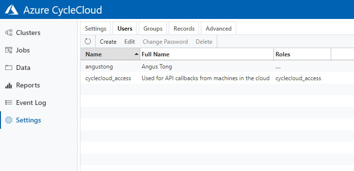
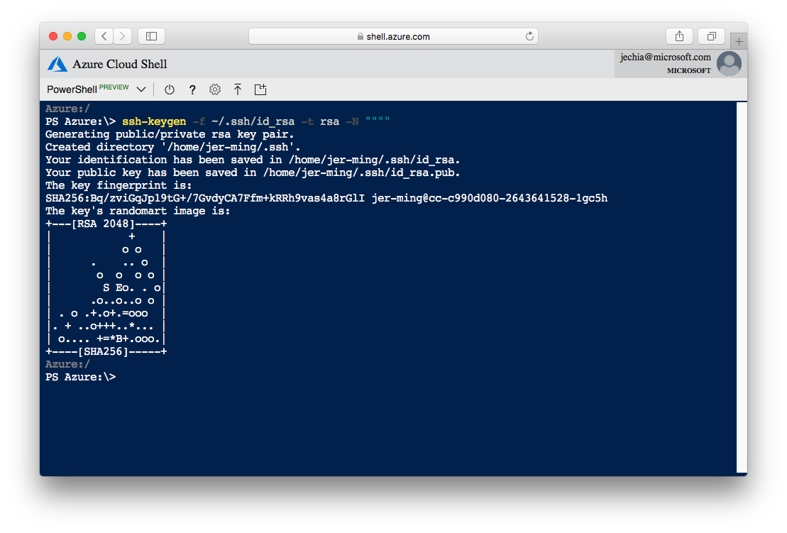

# Azure Cycle Cloud
Azure CycleCloud is an installable web application that you can run on premise or in your Azure subscription. Once installed, CycleCloud can be configured to use compute and data resources in your prepared Azure subscription. CycleCloud provides a number of official cluster templates including schedulers (Grid Engine, Slurm, HTCondor), filesystems (Redis, Avere), containers (Docker, Singularity) and many scientific applications. 

## Table of content
1. [Pre-requities](#pre-requisties)
2. [Deploying Azure CycleCloud Web Server](#deploying-azure-cycleCloud-web-server)
3. [Configure CycleCloud Web Server](#configure-cycleCloud-web-server)
4. [Create your own HPC Cluster](#create-your-own-hpc-cluster)
5. [Configure Settings in CycleCloud portal](#configure-settings-in-cyclecloud-portal)
6. [Touble with SSH](#trouble-with-ssh)

## Pre-requisties
1. Azure Subscription **Owner** Role (*Owner right is required to create Service Principal*)
2. Service Principal
    - Azure CycleCloud requires a service principal with contributor access to your Azure subscription. 

    - The simplest way to create one is using the [Azure CLI in Cloud Shell](https://shell.azure.com), which is already configured with your Azure subscription:
        ```
        $ az ad sp create-for-rbac --name CycleCloudApp --years 1
        {
                "appId": "xxxxxxxx-xxxx-xxxx-xxxx-xxxxxxxxxxxx",
                "displayName": "CycleCloudApp",
                "name": "http://CycleCloudApp",
                "password": "xxxxxxxx-xxxx-xxxx-xxxx-xxxxxxxxxxxx",
                "tenant": "xxxxxxxx-xxxx-xxxx-xxxx-xxxxxxxxxxxx"
        }
        ```
        - Save the output -- you'll need the `appId`, `password` and `tenant`. 

    - Alternatively, follow these [instructions to create a Service Principal](https://docs.microsoft.com/en-us/azure/azure-resource-manager/resource-group-create-service-principal-portal) 
        -  In this case, the authentication key is the `password`

3. An SSH key

    - An SSH key is needed to log into the CycleCloud VM and clusters
    - Specify a SSH public key, and that will be used in all CycleCloud Clusters as well as the application server.
    - See [section below](#trouble-with-ssh) for instructions on creating an SSH key if you do not have one.

4. Azure Storage Account
    - Search **Azure CycleCloud** in the search bar and find it under Marketplace.
    
    - Fill the required fields
        - `Subscription`: Select your own subscription
        - `Resource group`: *CycleCloud-rg* (Create a new resource group)
        - `Storage account name`: *cyclesharedstorage* (any unique name)
        - `Location`: *East Asia*
        - `Performance`: *Standard*
        - `Account kind`: *StorageV2*
        - `Peplication`: *Locally-redundant storage (LRS)*
        - `Access tier`: *Hot*
    - **Review + create** and start the deployment

## Deploying Azure CycleCloud Web Server
### From the Azure Portal
1. Search **Azure CycleCloud** in the search bar and find it under Marketplace.
    

    Select **Azure CycleCloud 7.9.x** version and click **Create** Button.
    
2. Fill the required fields 
    - `Subscription`: Select your own subscription
    - `Resource group`: *CycleCloud-rg* (Same group with Storage account)
    - `Virtual machine name`: *cyclevm*
    - `Region`: *East Asia*
    - `Size`: *Standard E4s v3*
    - `Authentication type`: *SSH public key*
    - `Username`: Anyname you like
    - `SSH public key`: Use the public key which is created in pre-requisties step
3. Select **Standard HDD** in Disk page
4. Click **Review + create** button and start the deployment
5. Once the deployment is done, click **Go to resource** to view the virtual machine. Alternatively, the virtual machine can be found in created resource group.

## Configure CycleCloud Web Server
1. Go to the **cyclevm** page and view the essentials
2. Clone the **Public IP address** and paste in any browser to visit CycleCloud login page
    *Web Server will take additional 5 minutes to launch the cyclecloud software after the virtual machine is running*
    
3. Ignore the warning page and proceed to *ip address* 
    *The default security certificate is a self-signed certificate. Therefore, there will be a warning page.*
    
4. Finish Initial Setup for CycleCloud
    *Copy down the credential for future use*
    
5. Click **Click here** and configure Cloud Provider Account
    Fill the required fields
    - `Account Name`: *Cycle Account*
    - `Cloud Environment`: *Azure Public Cloud*
    - `Tenant ID`: Copy from Service Principal (created in pre-requisties step)
    - `Application ID`: Copy from Service Principal (created in pre-requisties step)
    - `Application Secret`: Copy from Service Principal (created in pre-requisties step)
    - `Subscription ID`: Your own subscription ID
    - `Default Location`: *East Asia*
    - `Resource Group`: *CycleCloud-rg*
    - `Storage Account`: *cyclesharedstorage* (created in pre-requisties step)
    - `Storage Container`: *cyclecloud*
6. Finish configuration and view the home page of CycleCloud 
    

## Create your own HPC Cluster
Depends on the requirements of the job nature, user can create a cluster based on default template or custom template. 
### Default template
If the program and enivronment is compiled as a file for job running, default template is recommended. When the user creates the default template, there will be an empty cluster with the job scheduler only on both master node and worker node. 
Go to [default cluster template tutorial](https://docs.microsoft.com/en-us/azure/cyclecloud/quickstart-create-and-run-cluster)

### Custom template
If there is a need to install specific software and libraries for job running, custom template is recommended. Custom template is required to be built in advance and it is a virtual machine image on Azure. When the user creates the custom template, there will be a customized cluster with the job scheduler and installed software on both master node and worker node. 
Go to [custom cluster template tutorial](https://github.com/antong-git/AzureCycleCloud/tree/master/custom_cluster_template_tutorial)

## Configure Settings in CycleCloud portal
### Add users to the CycleCloud portal
1. Click **Setting** button on the left menu bar and navigate to **Users** sub-page

2. Click **Create** button and fill the new user info (SSH Public Key is required to allocate for each user)

## Trouble with SSH
### Generate SSH key with PowerShell 
Both Bash and Powershell variants of the Azure Cloud Shell have the SSH client tools installed.
1. To generate an ssh-key:

2. To obtain the public key of the generated key, run the following command and copy the output:

        PS Azure:\> cat ~/.ssh/id_rsa.pub

3. You may also SSH into the VM from Cloud Shell:

       PS Azure:\> ssh username@cyclecloud.fqdn 

### Generate SSH key with PuTTY Key Generator
1. Download PuTTY at https://www.putty.org/
2. Launch PuTTYgen from local computer 
3. Generate RSA public/private key pair
4. Save the public/private key pair 