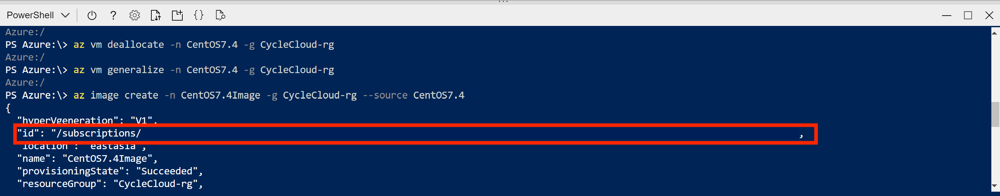
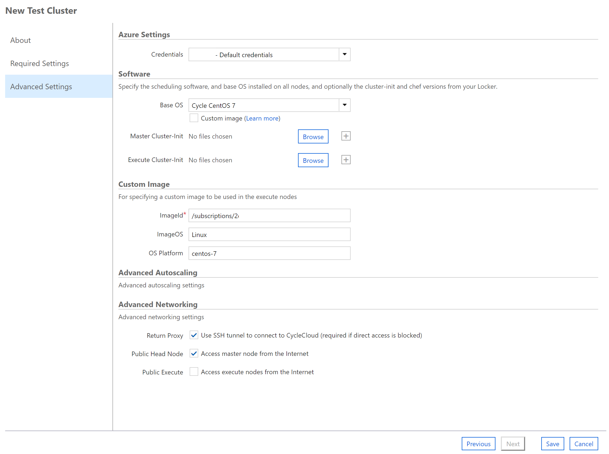

# Custom Cluster Template Tutorial
## Create Custom Image from Azure Virtual Machine 
1. Go to Azure Portal, search the desired Cluster OS

2. Fill in the information, and choose **SSH punlic key** as authentication type

Choose **Standard HDD** for the OS disk type

Click on ‘Review + create’ to skip other steps and continue.

3. Once the VM is ready, connect to the VM

4. Enter the following command line to make a VM image

At VM: 
**sudo waagent -deprovision+user**

At Azure CLI, replace the value inside []: 

**az vm deallocate -n [Source VM] -g [Resource Group]**
**az vm generalize -n [Source VM]-g [Resource Group]**
**az image create -n [Image Name] -g [Resource Group]--source [Source VM]**

Copy the value **id** of the response object

## Apply a Custom Template for CycleCloud

1. Download the Template Script **customTemplate.txt** from this repository

2. You may customize the Template icon and NFS size setting thorough editing the values in **customTemplate.txt**
* Name: [cluster "Your Template Name"]
* icon: IconUrl = "Your icon url"
* Number of NFS: Add **[[[volume nfs-]]]** node
* Size of NFS: Inside the **[[[volume nfs-]]]** node, change the **Size**

3. Connect to CycleCloud VM

4. Enter the command line in the CycleCloud VM:
Login the CycleCloud with your CycleCloud web interface account
*  $ cyclecloud initialize --batch --url=https://localhost --verify-ssl=false --username=[User ID] --password=[Password]
Get the Custom Template script from GitHub
*  $ wget https://raw.githubusercontent.com/hugoTO/Azure-CycleCloud/master/custom_cluster_template_tutorial/customTemplate.txt
Import the template
* $ cyclecloud import_template -f customTemplate.txt --force

## Create a Custom Cluster based on Custom Image
1. Click "+" to add a cluster and select the Template that you have imported

2. In the **Required Settings tab**, select the **desired VM type** for Master node and execute node, and select the subnetID from your **CycleCloud Resource Group**.

3. In the **Advanced Settings tab**, provide the imageid that you have obtained from the VM image 

## Transfer data to cluster master node
### AzCopy

### Rsync 
