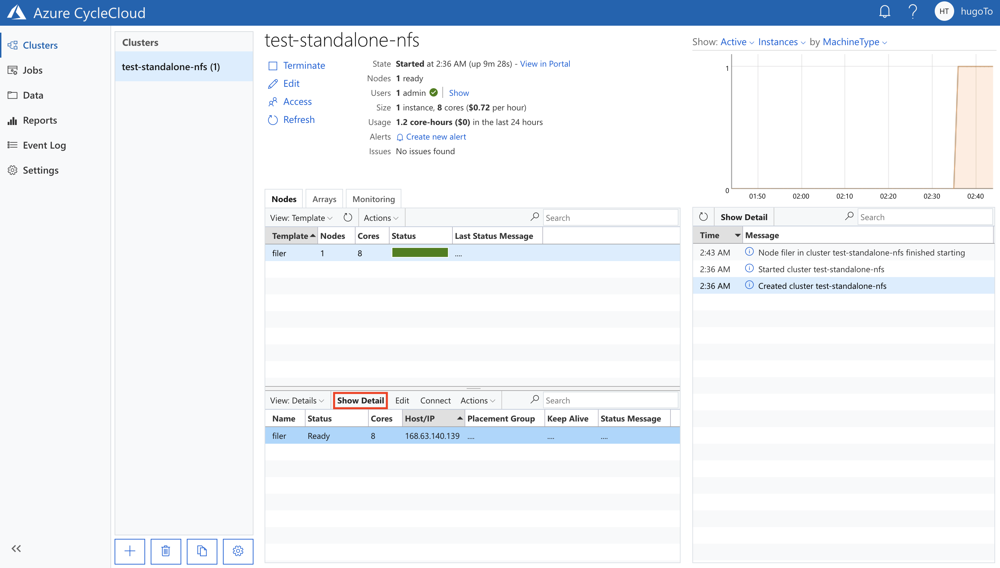
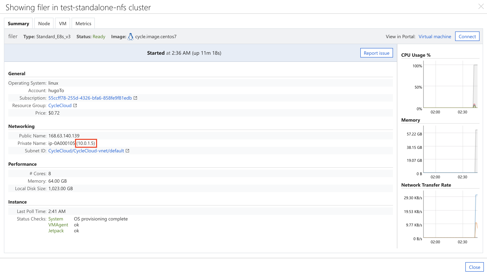
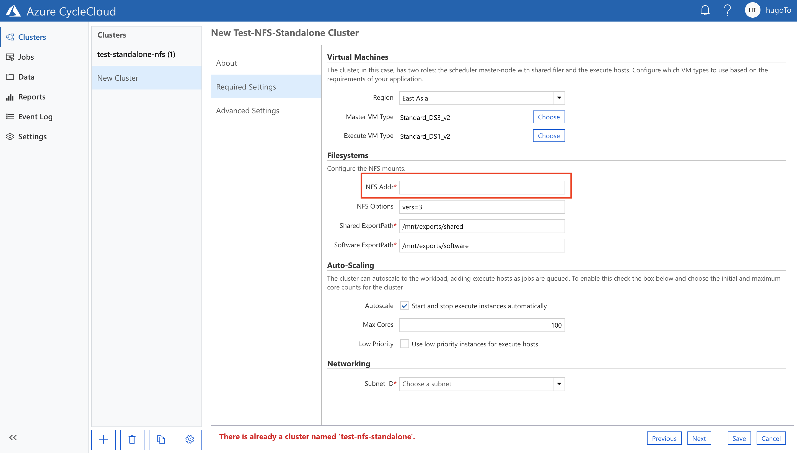

# Standalone NFS Tutorial 

## Create NFS

### Get the NFS template file and import it to CycleCluod

1. Open a terminal session and connect with your CycleCloud Server

2. Download the Template Script **custom-nfs.txt** from this repository

3. You may customize the Template icon and NFS size setting thorough editing the values in **custom-nfs.txt**, or direct use the template script in this github later on

         Name: [cluster "Your Template Name"]

         Number of NFS: Add [[[volume nfs-]]] node

4. Connect to CycleCloud VM

5. Enter the command line in the CycleCloud VM:

Login the CycleCloud with your CycleCloud web interface account

      $ cyclecloud initialize --batch --url=https://localhost --verify-ssl=false --username=[User ID] --password=[Password]

Get the Custom Template script from GitHub, or from your side

      $ wget https://raw.githubusercontent.com/hugoTO/Azure-CycleCloud/master/nfs_standalone_implementation/custom-nfs.txt

Import the template

      $ cyclecloud import_template -f custom-nfs.txt --force

### Get the Cluster Template for NFS and import it to CycleCluod

To import the cluster:

1. Open a terminal session and connect with your CycleCloud Server

3. Download the Template Script **custom-cluster-with-nfs-setting.txt** from this repository, or direct use the template script in this github later on

4. You may customize the Template icon and NFS size setting thorough editing the values in **custom-nfs.txt**

         Name: [cluster "Your Template Name"]

         icon: IconUrl = "Your icon url"

5. Connect to CycleCloud VM

6. Enter the command line in the CycleCloud VM:

Login the CycleCloud with your CycleCloud web interface account

      $ cyclecloud initialize --batch --url=https://localhost --verify-ssl=false --username=[User ID] --password=[Password]

Get the Custom Template script from GitHub, or from your side

      $ wget https://raw.githubusercontent.com/hugoTO/Azure-CycleCloud/master/nfs_standalone_implementation/custom-cluster-with-nfs-setting.txt

Import the template

      $ cyclecloud import_template -f custom-cluster-with-nfs-setting.txt --force

### Create the Cluster Server in CycleCloud and connect to the NFS Server

#### Create the NFS 
1. Go to your CycleCloud Server Website

2. Click "+" to add a cluster and select the ***NFS Template*** that you have imported

3. Fill in the information and click save

4. Start the cluster and wait util it's set up

5. Select to the NFS Sever node, and click ***Show Detail***

6. Copy the ***Private Name*** of this node

#### Create the Cluster
1. Click "+" to add a cluster and select the ***Cluster Template for NFS*** that you have imported

2. In ***Required Settings***, provide the NFS Server Node private address that you have saved earlier

3. Fill in the information and click save

4. Start the cluster

